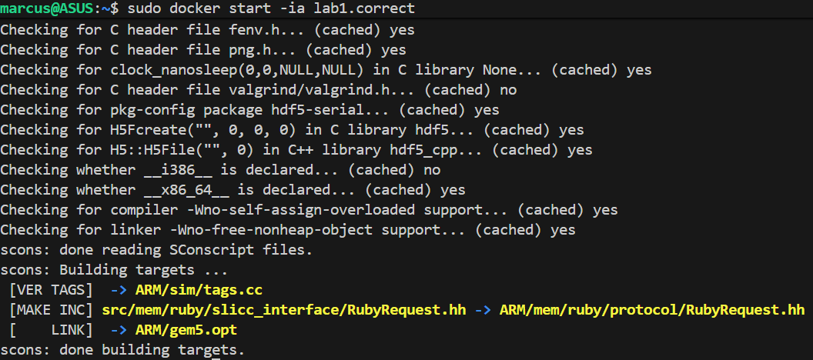
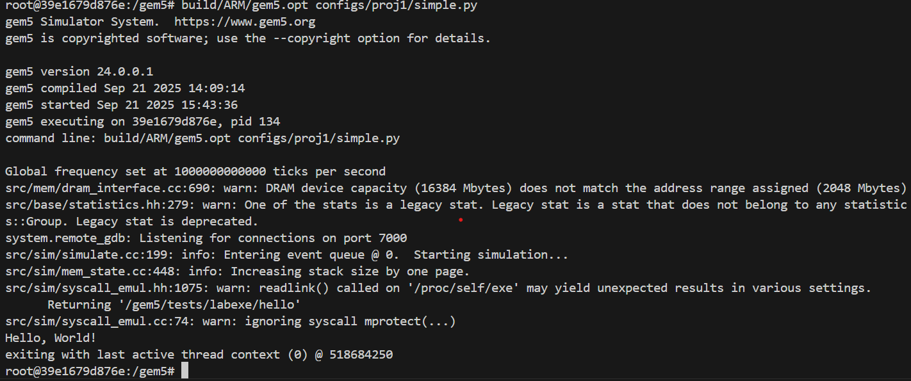
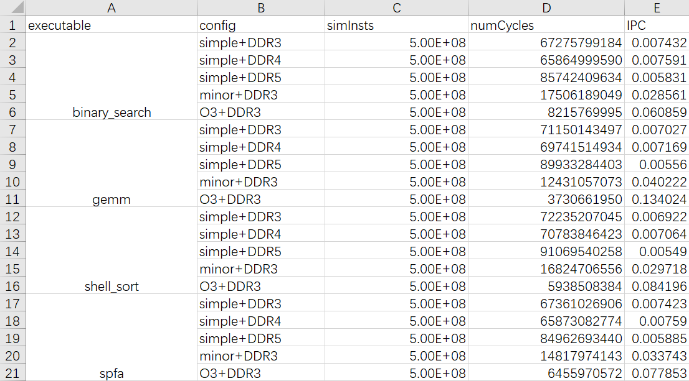
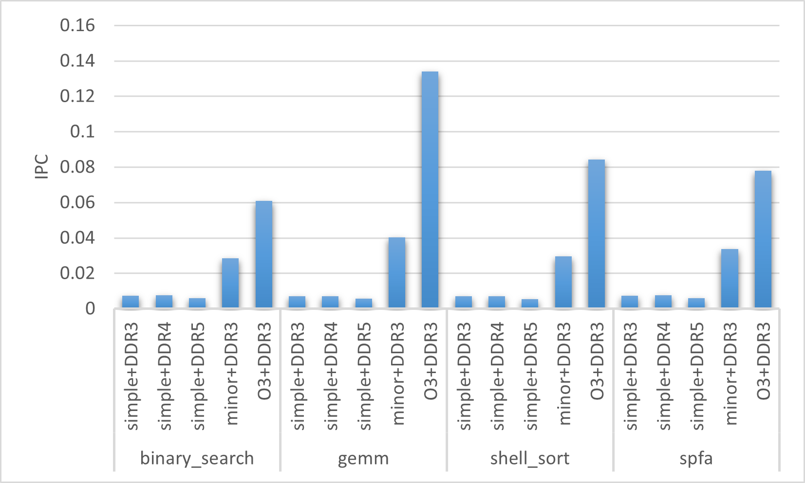

# Project 1 Report
 School of Life Science ZhouBaichuan 2300012301 

## 1. Introduction
This project use gem5 to simulate a basic computer system and run some complex executables. Also we will use gem5 outputs to analysis the performance of difference computers and executables.

## 2. Experiment Setup

### 2.1 Environment
- **gem5 Version:** download from https://github.com/ChaseLab-PKU/archlab-gem5
- **Host System:** Ubuntu 22.04 from WSL2
- **Hardware configuration:** CPU: i7-13700HX, GPU: 4060 Laptop, DRAM: 16GB DDR4 
- **Simulator Mode:** syscall emulation (SE) mode

### 2.2 System Configuration
- **CPU Model:** Simple CPU / Minor CPU / O3CPU
- **Memory:** 2GB DDR3 / 2GB DDR4 / 2GB DDR5
- **Other Parameters:** clock frequency: 2GHz

### 2.3 Benchmarks/Programs
- **Tested Programs:** 
  - `binary_search` 
  - `gemm` 
  - `shell_sort`
  - `spfa`


### 2.4 Simulation Commands
- Command to run a benchmark:
  ```
  ./build/X86/gem5.opt -d destdir configs/example/simple.py tests/labexe/gemm --cpu minor --mem DDR3
  ```
- use a max_insts_any_thread of 5e+8

## 3. Results


- **Figure 1**   
gem5 compiled correctly in the environment


- **Figure 2**  
  output of `hello` on stdout of my configuration script 


- **Figure 3**  
  Table of performances of difference executables and CPU/mem types


- **Figure 4**  
  Graph of performances of difference executables and CPU/mem types

## 4. Analysis

- **Performance Trends:** Different executables has different IPC, and advanced CPU/mem could improve the performance of executables. CPU has a bigger effect than memory.

## 5. Appendix

- **Codes and Raw Outputs:** Recources can be found at https://github.com/ZhouBC123/Autumn2025_PKUArchlab/lab1.

<!-- This report follows the deliverables and structure required in the project PDF. Fill in the bracketed sections with your actual data and details. -->
